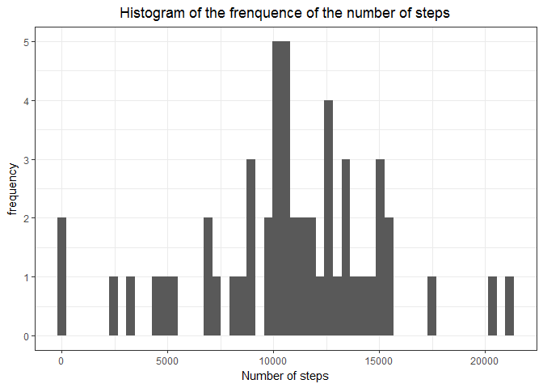
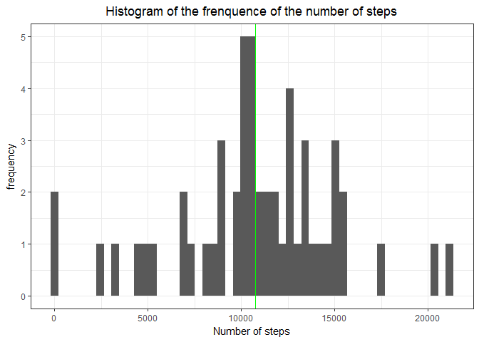
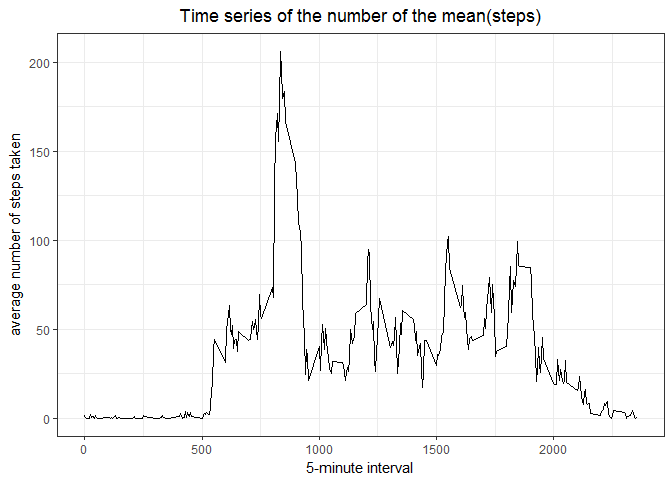
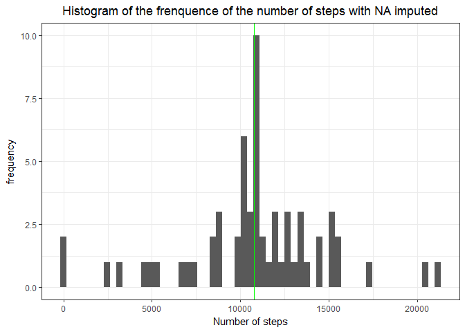
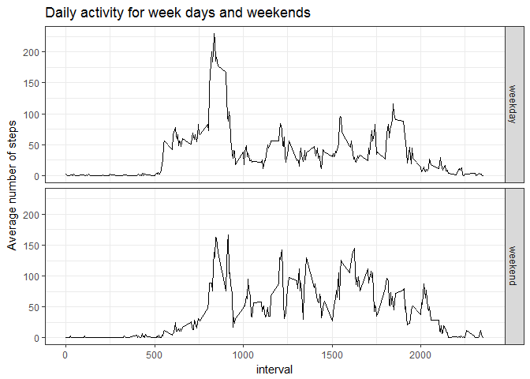

Untitled
================
Me
14 mai 2017

Loading and preprocessing the data
----------------------------------

1.  Load the data

``` r
library(dplyr)
```

    ## 
    ## Attaching package: 'dplyr'

    ## The following objects are masked from 'package:stats':
    ## 
    ##     filter, lag

    ## The following objects are masked from 'package:base':
    ## 
    ##     intersect, setdiff, setequal, union

``` r
library(tidyr) #may need it later

file = read.csv("D:/Cours/Coursera/Reproducible_research/Week2/activity.csv")
```

1.  Transform the data into a format suitable for your analysis

``` r
data = tbl_df(file)
```

What is mean total number of steps taken per day?
-------------------------------------------------

Calculate the total number of steps taken per day

``` r
library(ggplot2)
steps <- data %>% 
    na.omit() %>% #removing the NAs
    group_by(date) %>%
    summarise("number_of_steps" = sum(steps))
```

1.  Plotting the histogram

``` r
g <- ggplot(steps, aes(date)) + 
    geom_histogram(bins=53, aes(number_of_steps)) + 
    theme_bw() +
    ggtitle("Histogram of the frenquence of the number of steps") + 
    theme(plot.title = element_text(hjust = 0.5)) +
    xlab("Number of steps") + 
    ylab("frequency")

print(g)
```



3.Compute and reporting the mean and the median

``` r
meanSteps = mean(steps$number_of_steps)
medianSteps = median(steps$number_of_steps)
g  +
    geom_vline(xintercept = meanSteps, col="red", show.legend = TRUE) +
    geom_vline(xintercept = medianSteps, col = "green", show.legend = TRUE) 
```



-   Mean = 1.076618910^{4}
-   Median = 10765 In my data, the mean and the median are so close that they are not distinct on the graph, for some reason won't display the labels on the graph

What is the average daily activity pattern?
-------------------------------------------

``` r
stepsbyinterval <- data %>%
    na.omit() %>%
    group_by(interval) %>%
    summarise("number_of_steps" = mean(steps))
```

1.  Time series plot

``` r
ggplot(stepsbyinterval, aes(x=interval, y=number_of_steps)) +
    geom_line() +
    theme_bw() + 
    ggtitle("Time series of the number of the mean(steps)") + 
    theme(plot.title = element_text(hjust = 0.5)) +
    xlab("5-minute interval") +
    ylab("average number of steps taken") 
```



1.  Which 5-minute interval, on average across all the days in the dataset, contains the maximum number of steps?

``` r
maxSteps <- stepsbyinterval[which.max(stepsbyinterval$number_of_steps), 1]
```

The interval number **835** contains the maximum number of steps

Imputing missing values
-----------------------

1.Calculate and report the total number of missing values in the dataset

``` r
sumNAs = sum(is.na(data))
```

There are 2304 missing values in the dataset.

1.  and 3. Filling in all of the missing values in the dataset

``` r
#filling NAs with the mean of the interval
impute.mean <- function(x) replace(x, is.na(x), mean(x, na.rm = TRUE))
filledData <- data %>%
    group_by(interval) %>%
    mutate(steps=impute.mean(steps)) %>%
    ungroup
```

The strategy used to fill the missing values is using the mean for each interval

1.  

``` r
stepsPerDay <- filledData %>%
    group_by(date) %>%
    summarise("number_of_steps" = sum(steps))
    
meanStepsFilled <- mean(stepsPerDay$number_of_steps)
medianStepsFilled <- median(stepsPerDay$number_of_steps)
```

-   Mean = 1.076618910^{4}
-   Median = 1.076618910^{4}

Since we imputed the missing values with the means / interval, the overall mean is still the same.

``` r
ggplot(stepsPerDay, aes(date)) + 
    geom_histogram(bins=61, aes(number_of_steps)) + 
    theme_bw() +
    ggtitle("Histogram of the frenquence of the number of steps with NA imputed") + 
    theme(plot.title = element_text(hjust = 0.5)) +
    xlab("Number of steps") + 
    ylab("frequency") +
    geom_vline(xintercept = meanStepsFilled, col="red", show.legend = TRUE) +
    geom_vline(xintercept = medianStepsFilled, col = "green", show.legend = TRUE) 
```



Are there differences in activity patterns between weekdays and weekends?
-------------------------------------------------------------------------

1.  Create a new factor variable in the dataset with two levels - "weekday" and "weekend"

``` r
#indices of days of the weekend
library(lubridate)
```

    ## 
    ## Attaching package: 'lubridate'

    ## The following object is masked from 'package:base':
    ## 
    ##     date

``` r
filledData2 <- filledData

filledData2$date <- as.Date(filledData2$date) 
filledData2$day = ifelse(wday(filledData2$date-1) <6, "weekday", "weekend")
filledData2$day = as.factor(filledData2$day)
```

1.  Time series plot

``` r
filledData2 <- filledData2 %>%
    group_by(day, interval) %>%
    summarize(meanSteps = mean(steps))

ggplot(filledData2, aes(x=interval, y=meanSteps)) + geom_line() + facet_grid(day ~.) + ylab("Average number of steps") +
    ggtitle("Daily activity for week days and weekends") + 
    theme(plot.title = element_text(hjust = 0.5)) + 
    theme_bw()
```



As we can see, there is much less activity during the weekend.
